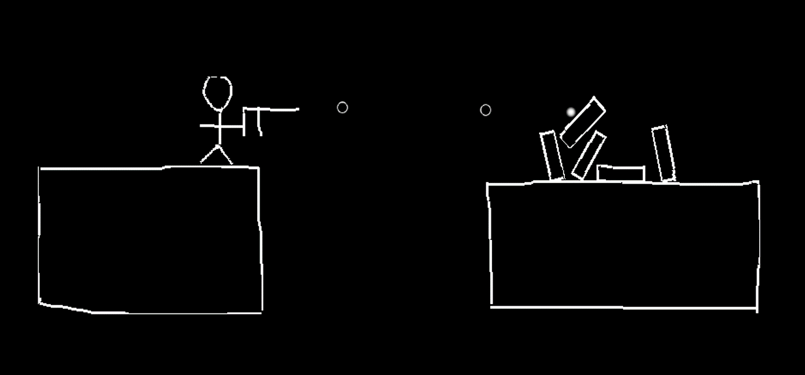
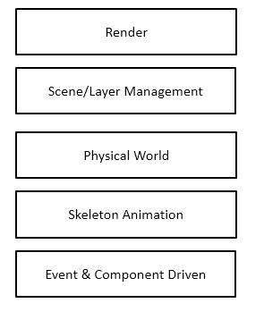

# SKetch2D Reference Guide

> Contributors:    Ziseon  emengjzs@163.com    Zak Penn [microsmadiopenn@gmail.com](mailto:microsmadiopenn@gmail.com)
>
> Documents:      Ziseon  


## 1. 总览

### 程序介绍

SKetch2D 是一个基于`Cocos2d`并结合手势识别技术的物理演示程序。它预设了多种物理模型，并提供手写识别设置，用户可以通过触控笔、鼠标或其他设备描绘物理模型，并根据现实中的物理规律对模型进行演示。本文档旨在对该演示程序的配置、原理、实现做简单介绍。



### 文档总览

第二章说明了程序开发和运行的配置要求。第三章介绍程序实现所基于的游戏框架Cocos2d。第四章介绍手势识别实现算法\$1和\$N。

### 阅读基础

为了能更加明白本文档所述内容，建议读者就以下主题有熟悉的基础：

- C++11 
- 基础图形学知识

##  2. 项目配置

### 环境

- Windows 7/8/8/1/10
- Visual Studio **2013** (with Update5 更佳)， **Visual Studio 2015 不保证能够正确运行**。[下载地址](https://www.microsoft.com/zh-cn/download/confirmation.aspx?id=48144)
- Python 2.7 ，请确保已设置环境变量，在命令行下通过输入`python`检查。

### 配置步骤

下载Cocos2dx-3.10，[下载地址](http://www.cocos2d-x.org/filedown/CocosForWin-v3.10.exe)。

安装或解压完毕后，找到路径`\Cocos2d-x\cocos2d-x-3.10\tools\cocos2d-console\bin`，在该目录下执行如下命令（可将`~/Desktop`替换为希望项目存放的文件夹位置，执行后项目位于该文件夹内）：

```shell
python cocos.py new Sketch2D -p cn.edu.nju.software.sketch -l cpp -d ~/Desktop
```

在项目存放的文件夹上（即文件夹Sketch2D所在位置），执行命令

```shell
git clone https://github.com/mspenn/Sketch2D.git Sketch2D-src
```

将`Sketch2D-src/Classes`下所有的文件复制到


## 3. 游戏引擎Cocos2d 

为了实现在第一章介绍的物理演示程序，我们需要考虑其中的主要功能实现点。1.程序应该允许用户在屏幕上使用合适的设备（鼠标、触控笔等）描绘图形并实时显示，物理模型也应该能够在屏幕上显示出来。2. 系统应该能够通过用户描绘的线段，识别并构建出相应形状，进而判断该形状所属的物理模型。形状和物理模型的对应关系通过用户设置，这不是难点，但关键是需要识别出用户描绘的到底是什么形状。3. 构建物理模型，判断出需要构造的物理模型后，需要依据模型的特性构建物体，包括形状、大小，以及相应的物理特性，如弹簧则拥有弹性，子弹则拥有动能，等等。4. 碰撞检测，由于大部分物理模型都是实体，因此在进行模型演示时，物体和物体之间的碰撞效果也应该表现出来，那么判断两个物体是否发生了碰撞则是关键。5. 动画条件，进行模型演示时会涉及到物体的移动，尤其当考虑物理规律下，动画应该能够反应符合物理常理的物体运动。6. 演示和控制，最后程序应该允许用户在程序上进行操作，这说明需要基本的交互界面。



以上的实现工作如果全部自己实现是十分困难的，幸运的是，借助于已有的物理引擎游戏框架，我们可以省去以上大部分的工作。游戏引擎是指一些已编写好的可编辑游戏系统或者一些交互式实时图像应用程序的核心组件。这些系统为游戏设计者提供各种编写游戏所需的各种工具，其目的在于让游戏设计者能容易和快速地做出游戏程序而不用由零开始。一般，游戏引擎一般包括：图形引擎、物理引擎、音频引擎、网络通信、AI编程、资源管理、脚本逻辑编写支持等多个功能，有了以上的组件，我们可以更快速地开发出上述程序。

本程序选择了Cocos2d游戏框架作为开发基础。

